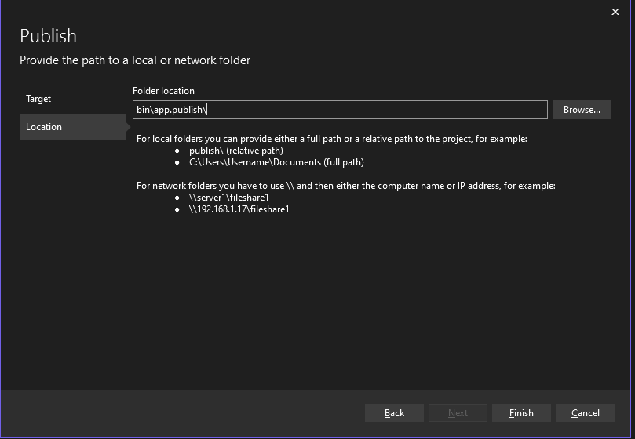
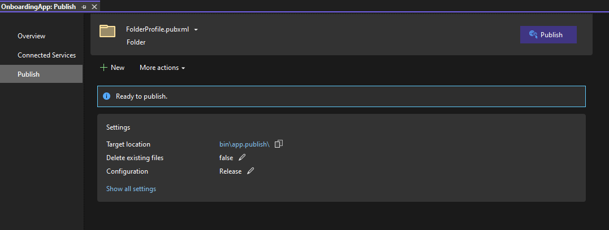

# Deploying

## Create a new `Folder` Publish Profile


## Publish to `bin\app.publish`



## Run Publish



## Create a `manifest.yml`

* Create a new file in the root of the project called `manifest.yml`
* **NOTE**: The `path` should point to the location of the `bin\app.publish` directory from the previous step

```yaml
applications:
- name: onboardingapp
  stack: windows
  buildpacks:
  - hwc_buildpack
  path: OnboardingApp/bin/app.publish
```

## Run `cf push`

* Open a Powershell terminal ad change directories to the location of the `manifest.yml`

```bash
cd C:\workspace\OnboardingApp

cf push
```

## Deploying a 32-bit application
* By Default, the `hwc_buildpack` assumes there are no 32-bit (x86) dependencies and runs as an x64 application
* To change this, the manifest has to be updated to use the `hwc_x86.exe` executable
* See the [Hosted Web Core Guide](hosted-webcore.md) on how to troubleshoot 32-bit applications locally

```yaml
applications:
- name: onboardingapp
  stack: windows
  buildpacks:
  - hwc_buildpack
  path: OnboardingApp/bin/app.publish
  command: .\.cloudfoundry\hwc_x86.exe
```