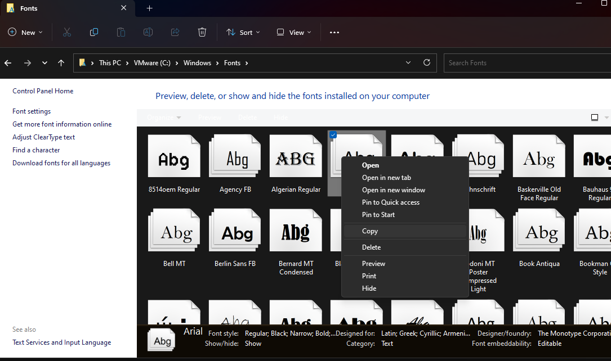
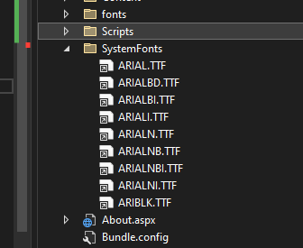

# Server Side Fonts

## Overview

* The [Windows Server Core container](https://hub.docker.com/_/microsoft-windows-servercore) that root filesystem for TAS is based contains very little system font files
* This becomes an issue for any server side file generation that relies on font files, such as PDF's and Word Doc files
* The following guide offers a workaround to manually load system fonts

## Locate and copy necessary font files
* Open File Explore and navigate to `C:\Windows\Fonts` on your desktop
* Copy files the app needs



## Add font files to the project
* Create a directory for fonts such as `SystemFonts`
* Paste the copied font files into that directory



# Create `App_Start\FontLoader.cs`

```csharp
using System;
using System.IO;
using System.Runtime.InteropServices;

namespace OnboardingApp.App_Start
{
    public class FontLoader
    {
        [DllImport("gdi32.dll")]
        static extern int AddFontResource(string lpFilename);
        public static void AddFont(string fontFilePath)
        {
            AddFontResource(fontFilePath);
        }

        public static void Load(string fontDir)
        {
            var files = Directory.GetFiles(fontDir);

            foreach (var file in files)
            {
                AddFont(file);
            }
        }
    }
}
```

# Update `Global.asax`

```csharp
namespace OnboardingApp
{
    public class Global : HttpApplication
    {
        void Application_Start(object sender, EventArgs e)
        {
            // Code that runs on application startup
            RouteConfig.RegisterRoutes(RouteTable.Routes);
            BundleConfig.RegisterBundles(BundleTable.Bundles);

            // load all font files in the directory into the system fonts table
            FontLoader.Load($"{AppDomain.CurrentDomain.BaseDirectory}\\SystemFonts");
        }
    }
}
```