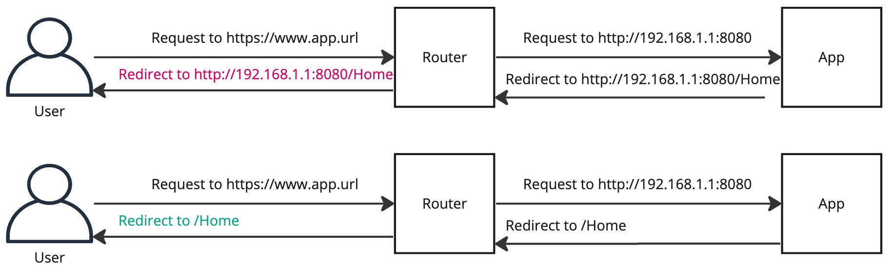

# URL Paths

* Tanzu Application Service like many container platforms, adds many layers of load balancing and request routing
* This can often result in URL mappings adding incorrect hostname, protocol (http/https), port, and prefix

## Examples of bad URL mappings

```bash
# IP address instead of hostname
http://192.168.1.1/resource instead of https://myapp.domain/resource

# Non-standard port in URL
http://myapp.domain:8080/resource instead of https://myapp.domain/resource

# prefix in URL
https://myapp.domain/prefix/resource instead of https://myapp.domain/resource

# http instead of https
http://myapp.domain/resource instead of https://myapp.domain/resource
```

